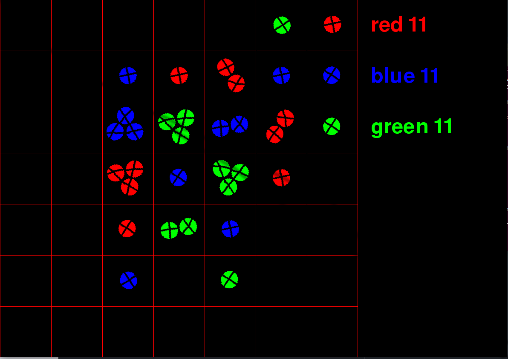
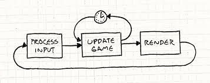

# Game Overview

The objective of Chain Reaction is to take control of the board by **eliminating your opponents' atoms.**

Players take it in turns to place their atoms in boxes.
Once a box has reached critical mass the box explodes into the surrounding boxes  
adding an extra atom and claiming the box for the player.  
A player may only place their atoms in a blank box or a box that contains atoms of their own colour.  
As soon as a player looses all their atoms they are out of the **game.**

# How it Works
  there are three important classes   
  `board` &nbsp; `box` &nbsp; and `animation`

  the board contains all boxes  
  user clicks on a box and adds a atom  
  then the turns cycle and a user can a place a maximum number of atoms in each type of box  
  `corner boxes` &nbsp; max of 1 *atom*  
  `edge boxes` &nbsp; max of 2 *atoms*  
  `others` &nbsp; max of 3 *atoms*  

  when a box reaches a maximum it sends its *atoms* to surrounding boxes  
  and this continues until a certain someone is the only one with atoms  

  a example of the game is shown  
    

  where there are three players `red` `green` `blue`

# Implementation  
  there are a total of &nbsp; **8 source files**

  `board.py` &nbsp; *does all the work of handling the game state itself*  
  `animation.py` &nbsp; *handles all the rendering of box to box movement*  
  `box.py` &nbsp; *useful encapsulation of a box and its methods*  
  `player.py` &nbsp; *contains methods related to the player*  
  `text_render.py` &nbsp; *has functions for text rendering needed across many files*  
  `end_game.py` &nbsp; *holds all methods to render the winning screen*  
  `chainreaction.py` &nbsp; *the whole chain of classes begins from here*  
  `conf.py` &nbsp; *user needs to specify their Configuration in this file*  

  game assets are stored in assets folder  
  *contains* the `atom images` and the `icon`  

  *all of this is explained in detail in the following pages*  

# Chain Reaction .py
  **pygame is initialized here**  
  `board` is constructed from the *conf file*  

  *used functions*  
  `pygame.time.Clock.tick(frames)` &nbsp; *useful timer to vary frames per second of the game*
  the `frames` specifies thge number of frames to render per second  
  for example if frames is *60* then this function pauses for 1/60 seconds  
  `pygame.display.flip`  &nbsp; *flips the old screen of the game with the new one*  

## Game Loop  
  

  *this is a typical game loop and all games start from here*  
  **Process Input**   
  the game state is updated everytime a new event occurs can be `keyboard` `mouse` `voice` etc   
  when the user clicks a box a click event is sent to board class and stores the event  

  **Update**   
  Now after a event has occured or any other internal change is updated in this *function*  
  for example in this game the game is updated when the `animation` moves further  
  or `box atom` rotates

  **Render**   
  finally after all updates the new *game screen* is shown to the user  

# Classes  

## Board

### Data Variables:
 
**data:** &nbsp;*holds all the data about the game* &nbsp; has duplicates for easy access   namely   
`self.rows:`  
`self.cols`  
`self.speed`  
`self.multiplier`    
`self.img_loc`  
`self.rotation_speed`  

**derived from data**  
`self.total_box_width`  *area of grid*    
`self.total_box_height`   
`self.total_width` *area of full window*  
`self.total_height`

**pygame side**  
`self.w1` *window initialized by pygame*   
`self.icon` *icon for the game*  

`self.img` *holds all the atom images* &nbsp; *type list*  
*has 4 surfaces namely one, two, three atom and animation atom*

`self.grid` &nbsp; *holds the grid image ->*  &nbsp; *type surface*   

### Dynamic containers:
 
`self.animations` &nbsp; *holds all animations->* &nbsp; *set type*  
`self.remove_cycle` &nbsp; *holds all animations to be removed ->* &nbsp; *set type*  
`self.box_list` &nbsp; *holds all the boxes ->* &nbsp; *type list*  
`self.players` &nbsp; *holds all the players ->* &nbsp; *type list*  
`self.alive_players` &nbsp; *holds all the alive players ->* &nbsp; *type list*

### Control Variables:
 
`self.running` &nbsp; *whether any animation is running ->* &nbsp;  *type bool*  
`self.main_running` &nbsp; *whether the main game is running ->* &nbsp; *type bool*  
`self.check_end` &nbsp; *when user event has occured and chance has to cycle ->* &nbsp; *type bool*

`self.animation_owners` &nbsp; *holds owners under animation ->*&nbsp; *type list*  
*required because a owner might not be in any boxes and game should not declare it not alive*  

`self.state` &nbsp; *state of game --*   
*1 for playing game   2 for in the end screen*

`self.count` &nbsp; *hold current total no of turns ->* &nbsp; *type bool*    
`self.end_setup` &nbsp; *if end_game has been setup ->* &nbsp; *type bool*  

### Other variables  
 
`self.end_game` &nbsp; *holds all methods for end screen ->* &nbsp; *type class*  
`self.current` &nbsp; *the turn of which player ->* &nbsp; *type class*  

### Functions
 
#### Init functions
 
**self.initwindow**&nbsp; *function to initialize pygame window*  

*additional info*

`pygame.display.set_mode(tuple)` &nbsp; *sets width and height of window*  
`pygame.display.set_icon(surface)` &nbsp; *sets the icon as the surface*  
`pygame.display.set_caption(str)` &nbsp; *sets the title of the window*  

**self.make_image** &nbsp; *loads atom images*

*additional info*  

`pygame.image.load(str)` &nbsp; *loads the image onto a surface*  
*the str is the filepath where the atom image is located*  

`pygame.surface.subsurface(x,y,w,h)` &nbsp; *makes a new surface with parameters*  
 *since the atom images has four images in one subsurface is required*  

`pygame.transform.scale(surface,(w,h))` &nbsp; *scales the image to the w,h*   
*this is required to scale the big image to fit inside the box dimensions*  

the surfaces are then converted to hold alpha value since the background of atom is not needed  

**self.make_boxes** &nbsp; *initialize all boxes*  

*additional info*  

to initialize all boxes first the row,col of box is setup  
then the box decides what type it is based on row and col  
and assumes the location of its surrounding boxes  

once all boxes are setup each pos of the surrounding box  
is converted into the class object at that position  

**player setup in board init** &nbsp; *initialize all players from data*

*additional info*  
setup all players based on position on the list  

**self.make_grid** &nbsp; *initialize grid surface*  

*additional info*  

`pygame.Surface(tuple,flags)` &nbsp;  *initialize a surface of w,h*  
*flag used is pygame.SRCALPHA for holding alpha value too*  

`pygame.draw.line(surface,color,pos,pos)` &nbsp; *draw of line with required parameters  
this is done in a loop with fixed step to draw lines*  
*this is called again in the end to draw the last line one pos behind*  
so that it is inside the window

#### Game Functions  
 

 **self.user_event(pos)** &nbsp; *function which is called when box is clicked*

*additional info*  

if *self.state* is 1  
check if click happened inside box dimensions  
then generate id for the box based on position  
and then only call add_atom when no animation is running  
and then set *check_end* to `True` to call cycle  

if *self.state* is 2  
this is the end_game screen  
call `end_game.update` defined in `class end_game`  

**self.check_change** &nbsp; *function to cycle to next player*  

*additional info*  

this function first checks `check_end` is `True` or not  
if *yes* then check `self.running` if `True` then  
call `self.cycle` and set *check_end* to `False`  
*otherwise do nothing*  

**self.cycle** &nbsp; *function to cycle to next player*  

*additional info*

*first increment `count`*  
then cycle to next player with modulus operator on total no of players  
`self.count%len(self.players)` *this automatically handles the case of the list reaching the end*  

*if the next player is not alive then cycle to next player in a while loop*  

**self.run** &nbsp; *main game logic function*

*additional info*  

first clear the screen  

if `self.state ` is 1  
this is the main game state  
call `self.update` then `self.render`  
then update the running state  and update alive players  
if there is only one alive then move to end_game by setting `self.state` to 2  

then render the player atom count and the sidebar   
then call check_change to check if turn has to be cycles

if `self.update_disp` is `True`  
this happens when player atom count changes
so that the display count can be updated on the next run

if `self.state` is 2  
first check if `self.end_setup` has been done
this is needed as the winner surface has to be made after `self.state` has been changed to 2 by the main game state  
but this doesnt have to be called every run  

then call `end_game.render` to handle the end_game logic  

**self.reset_all** &nbsp; *function to reset the game if reset is called in end_game*  

**self.render** &nbsp; *function to render the grid and atoms*  

*additional info*  

first to blit the *grid*  
if animation is running then render a white grid  
else render the grid with color of the current player  

then call `box.render` to render the atoms  
then call `animation.render` to render all animations  

**self.update** &nbsp; *function to update game state*  

*additional info*  
if `board.remove_cycle` has animations then *remove them*   
*called when remove_cycle length is not zero*  

then call `box.update` to update all boxes  
then running is set to `True`  

then update all *animations*  

**self.remove_animation(animation)** &nbsp; *this function adds animation to remove_cycle*  

*additional info*  
this function is used by animation class to add itself to remove_cycle  
then the animation has completed  

**self.remove_all**  &nbsp; *this function removes all animations in remove_cycle*  

**self.add_atom(index)** &nbsp; *this function adds an atom to the box*  

*additional info*  

first checks if the box specified has a owner  
if yes then check if it matches with the current player  
if not set ret to False  

if box has no owner then add owner as the current player to the box   

then add atom if passed condition

## Animation  

### Data Variables  
  `self.main_board` &nbsp; *pointer to baord object*  
  `self.direction` &nbsp; *direction of the animation up, left, down, right ->* &nbsp; *type dict (x,y)*    
  `self.speed` &nbsp; *speed of atom ->*  &nbsp; *type int*  
  `self.dest` &nbsp; *holds the destination location of atom ->* &nbsp; *type dict(x,y)*  
  `self.box_from` &nbsp; *the box who exploded*  
  `self.box_to` &nbsp; *the box where exploded atom reaches*   
  `self.owner` &nbsp; *holds the owner of the box who made this animation ->* &nbsp;  
  this is needed as *box_from* owner will become `None` after animation is made

### Dynamic Variables  
  `self.curr_loc` &nbsp; *holds the current location of atom ->* &nbsp; *type dict (x,y)*  
  updated every frame

### Init Functions  
 

**self.init(box_from,box_to,speed)**  &nbsp;

*additional info*  

direction is created by using `self.create_vector`   
then this player is added to `animation_owners` of *main_board*  
so that the player is is still alive when none of it is on the box  

### Logic Functions  
**self.render** &nbsp; *displays the atom on the screen*

*used functions*
`pygame.surface.blit(surface,loc)` &nbsp; *copies the surface on the surface instance called from*  

*additional info*  
`self.owner.img[3]` is the *image* of the animation *atom*  

**self.update** &nbsp; *updates the position of the atom*    

*additional info*  
`self.curr_loc` is first incremented by *direction x speed*  
then `self.check_completion` is called to check if atom has reached `box_to`  

**self.check_completion**  &nbsp; *checks if atom reached destination*  

*additional info*  
*dot product* along direction is compared between `self.curr_loc` and `self.dest` to   
check if atom has reached destination

**self.completion_event** &nbsp; *performs everything needed to end animation*    

*additional info*  
first this `animation` is removed from `main_board.animations`  
then this `animation` is added to `box_to` events  
this *animation*  is removed from `main_board.animation_owners` by `box_to` after it  
updates  

### Mathematical Functions  

**animation.create_vector(box_from,box_to)** &nbsp; *creates direction from from to to*

**animation.dot(vec1,vec2)** &nbsp; *performs dot product of vec1 and vec2*    

## Box  

### Data Variables  
`self.main_board` &nbsp; *the board class pointer*  
`self.surrounding` &nbsp; *the surrounding boxes*  
`self.holding` &nbsp; *the number of atoms currently held*  
`self.max` &nbsp; *the maximum number of atoms it can hold*  
`self.rotate_dir` &nbsp; *the direction of rotation*  
`self.speed` &nbsp; *the rotation speed of the atom*
`self.row` &nbsp; *the row of box*
`self.col` &nbsp; *the column where the box is*

`self.pos` &nbsp; *the location of box on the screen ->* &nbsp; *type list*   
*calculated* by multiplying `self.col` and `mainboard.multiplier`  
### Dynamic Variables  
`self.angle` &nbsp; *the current angle of the atom (from 0 to 360)*  
`self.events` &nbsp; *holds all events to be taken ->* &nbsp; *type list*    

### Init functions  

**self.init(main_board)** &nbsp; *creates a new instance*  

**self.setup(row,col)** &nbsp; *calculates surrounding box position*  

*additional info*  

first appends to `self.surrounding` , the positions of its surrounding  
based on its position  
then `main_board` will replace `self.surrounding`  with the box object at that position  

### Logic Functions  
 
**self.update** &nbsp; *process events*  

*additional info*  

if there is a event - *that is a* `animation` is in the `self.events` then  
take color from it  
if current owner is not `None`  
then remove current owner `means` *the new owner* has remoced the old one  
then add the new `self.owner`   
the add method on owner side sets `self.owner` by itself while adding this box to its list  
then add atom  
then remove the new owner from `main_board.animation_owners` since it has come back to the box   
finally remove *animation* from the game by popping it from the list   
then update rotation angle of the atom  

**self.render** &nbsp; *renders the atom inside the box*  

*used functions*  
`pygame.transform.rotate(surface,angle)` &nbsp; *rotate the image by angle*
`pygame.surface.blit(surface,loc)` &nbsp; *copies the surface on the surface instance called from*   

*additional info*  
when rotating the image the image gets padded with extra space since
a pygame surface is always a rectangle pixel data  
so need to render by center so that the atom doesnt move down  
so some extra math to determine the position  

**self.add_atom** &nbsp; *adds atom to box and explodes if needed*    

**self.expode** &nbsp; *add animation to surrounding*  

*additional info*  

first make animations from this `box` to the `surrounding`  
next remove `self.owner` and `self.owner`  
and then set holding to zero  

## Player  

### Data Variables  
`self.main_board` &nbsp; *the pointer to board*  
`self.name`  &nbsp; *name of player*  
`self.name_surface` &nbsp; *text rendered name*  
`self.img` &nbsp; *the surfaces of atoms,grid in its color*  
`self.grid` &nbsp; *the grid surface in its color*  
`self.color` &nbsp; *the color of player*  
`self.pos` &nbsp; *the postiion od player in the game sidebar*  
`self.holding_pos` &nbsp; *the position of atom count surface on sidebar*  

### Dynamic Variables  
`self.alive` &nbsp; *well you are right*  
`self.boxes` &nbsp; *the boxes it owns*  
`self.holding_text` &nbsp; *the holding number surface*  
### Init functions
 
**self.init(main_board,data,pos)** &nbsp;  

*functions used*  
*additional info*  
first color of the white surfaces are changed to its color  
then creates surfaces for name and updates it on the screen  

**player.change_color(surface,color)** &nbsp; *changes color of the surface*  

*used functions*
`pygame.surfarray.pixels3d(surface)` &nbsp; *returns a pixels structure [row[col[red,green,blue]]]*  
`pygame.surface.copy` &nbsp; *copies the surface*  

*additional info*  
the pixel3d function returns a pixel list which directly refers to the surface pixels  
now change the rgb component of each pixel to the `self.color`  
the alpha component is untouched  

### Logic functions

**self.add_box(box)** &nbsp; *adds box to `self.boxes`*  

*additional info*  
first box is added to list  
now player is alive since he will always have atleat one box after adding 1 box
the `main_board.update_disp` is `True` since the sidebar needs to be updated  

**self.rem_box(box)** &nbsp; *removed box from `self.boxes`*  

*additional info*  
first box is removed to list  
now player can or can not have no boxes so `self.alive` is from len of `self.boxes`
the `main_board.update_disp` is `True` since the sidebar needs to be updated

**self.render** &nbsp; *renders to game sidebar*  

*used functions*  
`pygame.surface.blit(surface,loc)` &nbsp; *copies the surface on the surface instance called from*

**self.update_holding** &nbsp; *updates `self.holding` of the player*

*additional info*  
the holding of each box is added up and a new surface with that number is created  

## End Game  

### Data variables

`pygame.Rect` &nbsp; *a structure holding w,h,x,y of a rectangle ,used to render the buttons*  
`self.main_board` &nbsp; *pointer to main_board*  
`self.again` &nbsp; *surface for play again button*  
`self.again_rect` &nbsp; *rectangle for the surface*  
`self.end` &nbsp; *surface for end game button*  
`self.end_rect` &nbsp; *rectangle for the surface*  

### Init Functions  
 
**self.init(main_board)** &nbsp;

*used functions*  
`text render class` &nbsp; *used to render text*  

*additional info*  
text is rendered and positioned based on the `dimesions` of the game `window`  

**self.setup** &nbsp; *creates the winner text surface*

*additional info*  
this function is called when a *player* wins and  
a surface containing their name is made  

**self.update(pos)** &nbsp; *function to take click event*  

*used functions*  
`pygame.rect.collidepoint(pos)` &nbsp; *checks if the point defined by pos is inside the rectangle*  

*additional info*  
the *buttons* `again` and `end` are defined by rectangles  
so when the use clicks any pos it checks if the point is inside  
the rectangle  

**self.render** &nbsp; *renders the button and winner surface*  
 *used functions*
 `pygame.surface.blit(surface,pos)` &nbsp; *copies the pixels of surface onto the surface instance from which it is called*

# Helper files  

## Text Render  
### Used Functions
 
`pygame.font.SysFont(font_str,size)` &nbsp; *creates a font renderer with the name of font and size*  
`pygame.font.SysFont.render(str,bool_alias,color)` &nbsp; *renders str with color*  
*antialias flag specifies if the text needs to have smoothened edges*  

##  Configuration File for the Game
*this contains all the info needed to init the game*  

### Specification
**data**   
`rows` &nbsp; *the number of rows ->* &nbsp; *type int*   
`cols` &nbsp; *the number of cols ->* &nbsp; *type int*    
`multiplier` &nbsp; *the size of box ( it is a square) ->*  &nbsp; *type int*    
`speed` &nbsp; *the speed of atom when moving from box to box ->* &nbsp; *type int*   
`rotation_speed` &nbsp; *the range of speed of rotation of atom ->* &nbsp; *type tuple*   
`icon_loc` &nbsp; *the path to icon ->*  &nbsp; *type str*  
`img_loc` &nbsp; *the path to atom images ->* &nbsp; *type str*  
`fps` &nbsp; *the frames per second of the game*  

**player data**  
*the player data is a list with each player as a dict under a specific criteria*  

*specification of player data*  
`name` &nbsp; *name of the player ->* &nbsp; *type str*  
`color` &nbsp; *color of the player ->* &nbsp; *type tuple(r,g,b)*  

### Example Configuration  

`data = {`  
    `"rows":7,`  
    `"cols":7,`  
    `"multiplier":75,`      
    `"speed":6, #speed of box to box movement`   
    `"icon_loc":"assets/atoms_c.ico",`   
    `"img_loc":"assets/atoms.png",`  
    `"title":"chainreaction2d",`  
    `"fps":75,`  
    `"rotation_speed":(7,9),`  
`}`  

`players = [`    
           `{"name":"red","color":(255,0,0)},`  
           `{"name":"blue","color":(0,0,255)},`
           `{"name":"green","color":(0,255,0)},`     
           `{"name":"yellow","color":(255,255,0)},`   
           `{"name":"orange","color":(255,165,0)},`  
           `{"name":"turquoise","color":(64,224,208)}`   
          `]`    
`data["players"] =players`
